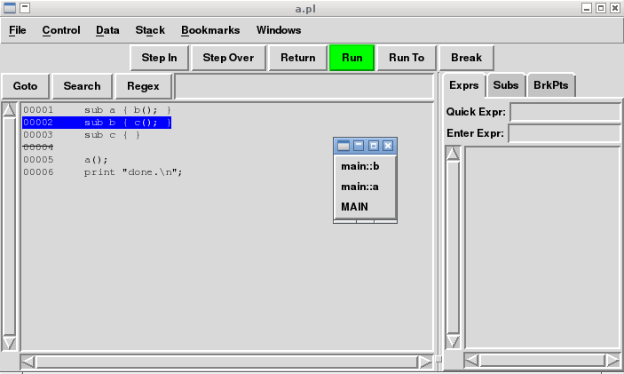

# Tips on Perl Debugging

---

# Agenda

- Better coding to reduce bugs
- Logging is almost all you need
- The ultima killer: Perl Debugger
- More tricks
- Recommended materials

---

# Better Coding To Reduce Bugs

- **DO** use `warnings` and `strict`
- Use `diagnostics` module for verbose explanation on warnings
- [perlcritic](http://search.cpan.org/dist/Perl-Critic/)
- Which perl executable are you using?
- Which perl version? 32bit or 64bit? thread support? @INC?
- local::lib + cpanminus, perlbrew
- PAR, PAR::Packer
- Unit test, Test::Differences
- Don't reinvent wheel, always check [CPAN](http://metacpan.org/) first
- KISS principal

---

# Logging Is Almost All You Need

- Data::Dumper
- Data::Rmap
- Smart::Comments
- Log4perl
- Carp, CGI::Carp

---

## Example: Data::Dumper

Dump data structures with automatically generated names or specified
names.

Code:

    !perl
    use Data::Dumper;
    
    print Dumper(\%ENV), Data::Dumper->Dump([\%ENV], [qw/ENV/]);

Result:

    $VAR1 = {
              'HOME' => '/root',
              'LANGUAGE' => 'en_HK:en',
              ...
            };
    $ENV = {
              'HOME' => '/root',
              'LANGUAGE' => 'en_HK:en',
              ...
            };

---

## Example: Data::Rmap

Traverse data structures recursively.

    $ perl -MData::Rmap -le 'print join ":", rmap { $_ } 1,2,[3..5],\\6'
    1:2:3:4:5:6

    $ perl -MData::Rmap=:all -MLWP::Simple -MHTML::TreeBuilder -le \
    'rmap_hash { print $_->{src} if $_->{_tag} eq "img" && $_->{src} } \
    HTML::TreeBuilder->new_from_content(get($ARGV[0]))' \
    http://www.yahoo.com
    
    http://l.yimg.com/a/i/mntl/ww/events/p.gif
    http://l.yimg.com/a/i/ww/met/intl_flag_icons/20111011/cn_flag.gif
    http://l1.yimg.com/a/i/ww/met/pa_icons_18/20101213/spr_apps_us.png
    http://l1.yimg.com/a/i/ww/met/pa_icons_18/20101213/spr_apps_us.png
    http://l1.yimg.com/a/i/ww/met/pa_icons_18/20101213/spr_apps_us.png
    http://l1.yimg.com/a/i/ww/met/pa_icons_18/flickr_20100602.gif
    http://l1.yimg.com/a/i/ww/met/pa_icons_18/20101213/spr_apps_us.png
    http://l1.yimg.com/a/i/ww/met/pa_icons_18/20101213/spr_apps_us.png
    http://l1.yimg.com/a/i/ww/met/pa_icons_18/monster_20110207.gif
    http://l1.yimg.com/a/i/ww/met/pa_icons_18/20101213/spr_apps_us.png
    http://l1.yimg.com/a/i/ww/met/pa_icons_18/20101213/spr_apps_us.png
    http://l1.yimg.com/a/i/ww/met/pa_icons_18/20101213/spr_apps_us.png
    http://l1.yimg.com/a/i/ww/met/pa_icons_18/myyahoo_20100602.gif
    http://l1.yimg.com/a/i/ww/met/pa_icons_18/news_20100602.gif
    ...

---

## Example: Smart::Comments

Embed debugging clauses into comments and easily turn on/off them.

Code:

    !perl
    ### show a scalar: $$
    ### show an array: @INC
    my %h = ( a => 1, b => 2 );
    ### show a hash: %h
    ### [<now>] show a text with timestamp...
    
    for (@INC) {    ### Couting \@INC [===|     ] % done
        sleep(1);
    }

Run:

    $ perl -MSmart::Comments a.pl

---

## Example: Smart::Comments (cont.)

Result:

    ### show a scalar: 23230
    ### show an array: [
    ###                  ...
    ###                  '/usr/share/perl/5.12',
    ###                  '/usr/local/lib/site_perl',
    ###                  '.'
    ###                ]
    
    ### show a hash: {
    ###                a => 1,
    ###                b => 2
    ###              }
    ### [Mon May 14 17:42:48 2012] show a text with timestamp...
    
    Couting @INC [|           ] 0% done
    Couting @INC [|           ] 9% done
    Couting @INC [=|         ] 18% done
    Couting @INC [==|        ] 27% done
    Couting @INC [===|       ] 36% done
    Couting @INC [====|      ] 45% done
    Couting @INC [=====|     ] 54% done
    Couting @INC [======|    ] 63% done
    Couting @INC [=======|   ] 72% done
    Couting @INC [========|  ] 81% done
    Couting @INC [=========| ] 90% done
    Couting @INC [==========|] 100% done

---

## Example: Carp

Code:

    !perl
    use Carp qw/cluck confess/;

    sub a { b(); }
    sub b { c(); }
    sub c { cluck("I'm here"); }

    a();

Result:

    I'm here at a.pl line 5
            main::c() called at a.pl line 4
            main::b() called at a.pl line 3
            main::a() called at a.pl line 7

---

# The Ultima Killer: Perl Debugger

- Perl debugger: `perldoc perldebug`
- Devel::ptkdb
- DDD

---

## Trace with Perl debugger

Code:

    !perl
    sub a { b(); }
    sub b { c(); }
    sub c { }

    a();
    print "done.\n";

Run:

    $ PERLDB_OPTS="NonStop frame=2 AutoTrace LineInfo=tperl.out" perl -d a.pl
    $ cat tperl.out
    Package a.pl.
    5:	    a();
    entering main::a
     1:	    sub a { b(); }
     entering main::b
      2:	    sub b { c(); }
      entering main::c
       3:	    sub c { }
      exited main::c
     exited main::b
    exited main::a
    6:	    print "done.\n";

---

## Devel::ptkdb

Run:

    $ perl -d:ptkdb a.pl

    (the float window is splitted call stack menu)

---

# More Tricks

- Devel::*
    - Devel::Cover
    - Devel::NYTProf
    - Devel::SmallProf
    - Devel::Trace
    - Devel::Peek
    - Devel::Size, Devel::Size::Report
- Apache::DB, Apache::DProf, Apache::SmallProf
- `use re 'debugcolor'`
- A naive example of AOP

---

## use re 'debugcolor'

Bad greedy matching, lead to backtrack.

    # naive example...
    $ perl -Mre=debugcolor -e '$ARGV[0] =~ /^(.*) (.*) (.*)$/' "111 222 333"
    ...
    Matching REx "^(.*) (.*) (.*)$" against "111 222 333"
       0 <111 222 33>|  1:BOL(2)
       0 <111 222 33>|  2:OPEN1(4)
       0 <111 222 33>|  4:STAR(6)     
                                      REG_ANY can match 11 times out of 2147483647...
       7 <111 222 333>|  6:  CLOSE1(8)
       7 <111 222 333>|  8:  EXACT < >(10)
       8 <111 222 333>| 10:  OPEN2(12)
       8 <111 222 333>| 12:  STAR(14)   
                                        REG_ANY can match 3 times out of 2147483647...
                                        failed...
       3 <111 222 333>|  6:  CLOSE1(8)
       3 <111 222 333>|  8:  EXACT < >(10)
       4 <111 222 333>| 10:  OPEN2(12)
       4 <111 222 333>| 12:  STAR(14)   
                                        REG_ANY can match 7 times out of 2147483647...
       7 <111 222 333>| 14:    CLOSE2(16)
       7 <111 222 333>| 16:    EXACT < >(18)
       8 <111 222 333>| 18:    OPEN3(20)
       8 <111 222 333>| 20:    STAR(22)   
                                          REG_ANY can match 3 times out of 2147483647...
      11 <111 222 333>| 22:      CLOSE3(24)
      11 <111 222 333>| 24:      EOL(25)
      11 <111 222 333>| 25:      END(0)
    Match successful!

---

## use re 'debugcolor' (cont.)

Is non-greedy matching OK? Not efficent for this case.

    $ perl -Mre=debugcolor -e '$ARGV[0] =~ /^(.*?) (.*?) (.*?)$/' "111 222 333"
    Matching REx "^(.*?) (.*?) (.*?)$" against "111 222 333"
       0 <111 222 33>|  1:BOL(2)
       0 <111 222 33>|  2:OPEN1(4)
       0 <111 222 33>|  4:MINMOD(5)
       0 <111 222 33>|  5:STAR(7)     
                                      REG_ANY can match 3 times out of 3...
       3 <111 222 333>|  7:  CLOSE1(9)
       3 <111 222 333>|  9:  EXACT < >(11)
       4 <111 222 333>| 11:  OPEN2(13)
       4 <111 222 333>| 13:  MINMOD(14)
       4 <111 222 333>| 14:  STAR(16)   
                                        REG_ANY can match 3 times out of 3...
       7 <111 222 333>| 16:    CLOSE2(18)
       7 <111 222 333>| 18:    EXACT < >(20)
       8 <111 222 333>| 20:    OPEN3(22)
       8 <111 222 333>| 22:    MINMOD(23)
       8 <111 222 333>| 23:    STAR(25)
       8 <111 222 333>| 25:      CLOSE3(27)
       8 <111 222 333>| 27:      EOL(28)    
                                            failed...
                                          REG_ANY can match 1 times out of 1...
       9 <111 222 333>| 25:      CLOSE3(27)
       9 <111 222 333>| 27:      EOL(28)    
                                            failed...
                                          REG_ANY can match 1 times out of 1...
      10 <111 222 333>| 25:      CLOSE3(27)
      10 <111 222 333>| 27:      EOL(28)    
                                            failed...
                                          REG_ANY can match 1 times out of 1...
      11 <111 222 333>| 25:      CLOSE3(27)
      11 <111 222 333>| 27:      EOL(28)
      11 <111 222 333>| 28:      END(0)
    Match successful!

---

## use re 'debugcolor' (cont.)

Off-topic, tips on efficient regular expression:

- narrow character range, don't blindly use "." meta character
- greedy matching is excellent if you do hope backtrack happens 
- don't blindly use non-greedy matching, usually greedy limited character range is better
- use possessive quantifier to forbid backtrack (_require perl v5.10_)

Example: parse URL to extract suffix of path or base name if no suffix

    !perl
    use 5.010;

    m{
      ^(?:[^:]+.//)?+
      ([^/]++)
      [^?]*
      (?|
         (\.[^?]*)
         |
         /([^?]*)
      )
    }x

Question: how to modify the regex to match URLs without path part?

---

## A naive example of AOP

Code:

    !perl
    sub fib {
        my $n = shift;
    
        return fib($n - 2) + fib($n - 1) if $n > 1;
        return 1 if $n == 1;
        return 0;
    }
    
    my $orig_fib = \&fib;
    my $depth = 0;
    *main::fib = sub {
        print "  " x $depth, "calling fib($_[0])...\n";
        ++$depth;
        my $n = $orig_fib->($_[0]);
        --$depth;
        print "  " x $depth, "got $n\n";
        return $n;
    };
    
    fib(4);

Run:
    $ perl fib.pl

---

## A naive example of AOP (cont.)

Result:

    calling fib(4)...
      calling fib(2)...
        calling fib(0)...
        got 0
        calling fib(1)...
        got 1
      got 1
      calling fib(3)...
        calling fib(1)...
        got 1
        calling fib(2)...
          calling fib(0)...
          got 0
          calling fib(1)...
          got 1
        got 1
      got 2
    got 3

You can do more tricks with builtin subroutine `caller()` to judge call stack,
or check [Aspect](http://search.cpan.org/dist/Aspect/) for more power.

---

# Recommended Materials

- "Learning Perl"
- "Modern Perl"
- "Perl Best Practices"
- "Perl Debugged"
- And, `perldoc` is your friend!

